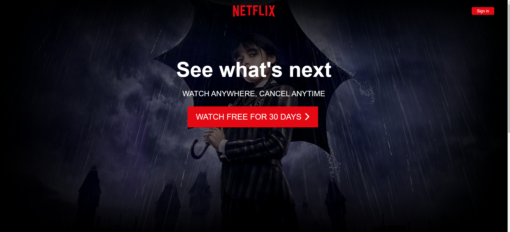

# Netflix-Landing-Page

A replica of the Netflix front page built using HTML, CSS, and JavaScript.

## Getting Started

These instructions will get you a copy of the project up and running on your local machine for development and testing purposes.

### Prerequisites

No dependencies are required to run this project.

### Installing

To install the project, simply clone or download the repository and open the `index.html` file in a web browser.

### Running the tests

There are no automated tests for this project.

### Deployment

To deploy the project, simply upload the files to a web server or hosting service   or go to this link https://sid1552.github.io/Netflix-Landing-Page/

## Built With

* HTML
* CSS
* JavaScript

## Authors

* **Siddharth Singh** - https://www.github.com/sid1552

## Acknowledgments

* Hat tip to the Netflix team for the inspiration and design of the original front page.
